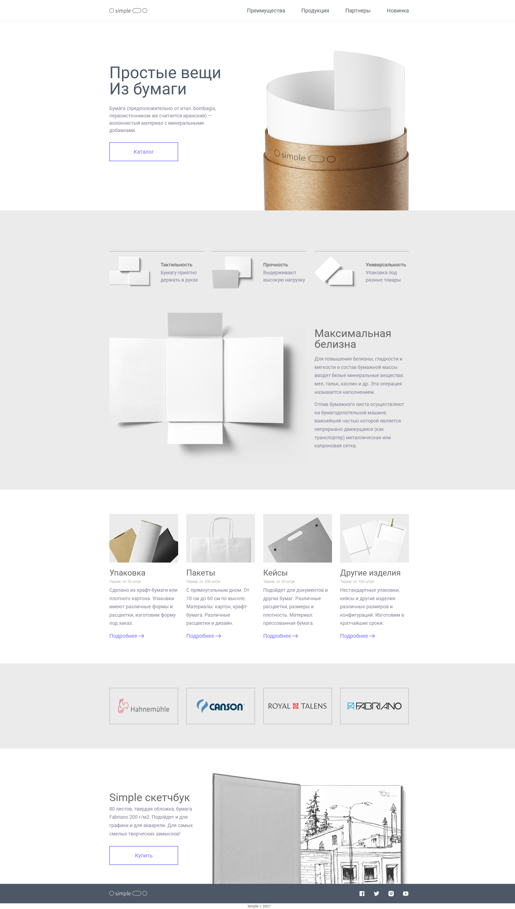

# Simple

## Технологии

<div id="steck">
	
	
  
	
</div>

## Тематика сайта
Изготовление бумажных изделий под все нужды человека.

## Превью главной страницы


## Архитектура проекта

```
├── public - директория для иконок и превью изображений
│ 
├── src - рабочая директория
│   ├── assets
│   │	├── fonts - директория шрифтов
│   │	├── images - директория изображений
│   │   └── styles
│   │       ├── fonts.scss - стили инициализация шрифтов
│   │       ├── general.scss - глобальные стили сайта
│   │       ├── reset.scss - файл сброса стилей браузеров
│   │       └── variables.scss - файлы переменных
│   │
│   ├── components - директория компонентов
│   │	├── wigsets
│   │	└── ui 
│   │
│   ├── App.tsx - 
│   ├── main.tsx - 
│   └── vite-env.d.ts - файл определения типов переменных окружения 
│
├── .gitignore
├── eslint.config.js
├── index.html
├── package.json
├── README.md
├── tsconfig.app.json
├── tsconfig.json
├── tsconfig.node.json
└── vite.config.ts
```

## Запуск проекта

Для запуска проекта необходимо выполнить следующие действия:

1. С клонировать проект на ваш компьютер с [Github](https://github.com/sweetconsole/simple) с помощью команды:
```
git clone https://github.com/sweetconsole/simple.git
```
2. Установить зависимости:<br>
```
npm install
```
3. Запустить проект:<br>
```
npm start
```